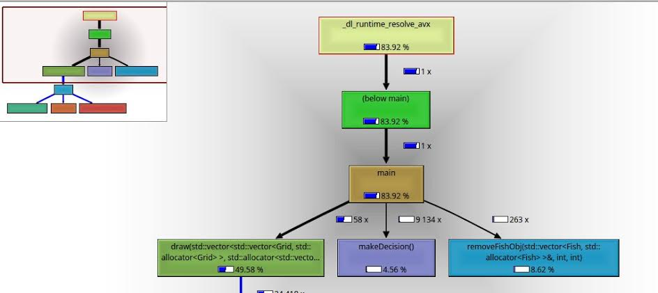
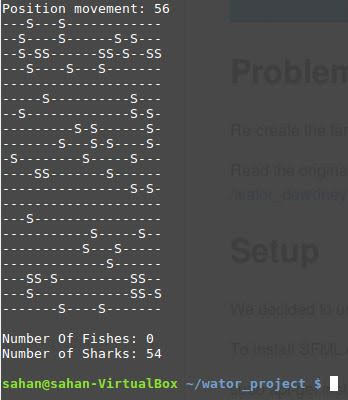

Wator
Software Development Year 4 Project Wojciech Teodorowicz and Sahan Ekanayake.
Concurrent Device Development Module

Run the pgroggram.

1. First run MakeFile in terminal this will compile the proggram and create an output file.
2. then run ./profile.sh in terminal this will produce benchmarking for the project.

Output of the Proggram.

